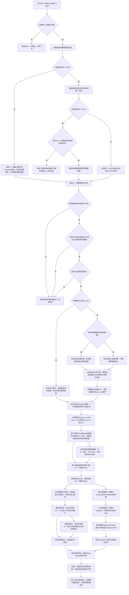

# SPEC：Amazon 周报前端价格捕捉任务

> 当前规格，更新于2026-09-08。只维护本文件这一套业务口径。实现差距必须明确记录在[REVIEWS](REVIEWS.md)，测试与历史证据在[TASKS](TASKS.md)；不得把规格要求当作已经通过真实验收。
>
> 旧版已完整保存到[历史目录](history/README.md)，其中“每周新建结果表”“HTML门禁”“仅下午执行”“8月31日截止”不再是当前规则。

## 1. 目标与边界

每周一至周五北京时间07:30、15:30执行价格任务，每天两次、无截止日期、周末不执行。不依赖GPT界面；依赖Windows开机、交互账号登录和可用网络。换周不是两个时段都立即切换：周一07:30为“上周延续批次”，必须读取上一周已经固化的周报快照；周一15:30为“本周切换批次”，才读取固定登记表中的最新有效周报并建立新的快照。周二至周五两个时段沿用周一15:30已经确认的本周周期，除非人工明确执行换周维护。

固定链接登记表仍是周报来源控制面，但“登记表最新链接”和“本时段应使用的来源周期”不是同一个概念。周一07:30可以只读检查登记表，却不得因为登记表已经出现本周新链接而提前切换；周一15:30必须重新读取并验证最新有效链接，若没有比上一周期更高的有效序号则安全停止并通知周成业，不得静默继续使用上一周。每个正式来源周期建立一个只读完整快照，重新发现业务子表、提取A:G、抓取Amazon实时价格并完成前端检查，同时从两个店铺的Seller Central Feedback管理器读取低于三星的feedback，最后写入同一个固定结果Spreadsheet及其固定Feedback子表。固定的是字段位置和结果链接，不是A:G的数据。明确恢复已有run_id时才复用原批快照，禁止混用新基础数据和旧价格。

价格任务与HTML独立：正式 `--weekly-run` 和 `--weekly-push-only` 强制关闭HTML捕获、HTML必需门禁和HTML服务依赖；默认配置、实际配置及模板均关闭归档与服务。既有HTML只读留存，不清理、不改名、不提交Git；8765服务和自启动任务停用。代码与手工脚本保留，日后如要恢复必须作为独立功能重新验收。禁止使用旧HTML替代实时价格。

### 1.1 端到端流程图

凡涉及数据来源、换周、列布局、抓取、交付或通知的变更，必须同步更新此图和对应章节。



跨子表不是云端原子事务；每段回读后计入成功，局部写入失败保留已成功范围并继续其他子表，不承诺瞬时全表切换。真实运行待验收项见REVIEWS。

## 2. 运行环境与依赖

Windows、Python 3.10+、Chromium/DrissionPage。Python依赖以 `config/requirements.txt` 为准。HTML封装依赖仅用于独立HTML功能，不是正式价格运行前提。

飞书应用需要读取登记表、Wiki和周报，复制原表、管理新快照协作者、读取及编辑固定结果表和必要时添加业务子表，以及查询应用协作者并发送消息。应用可用范围与文档访问权限是两件事，不自动扩大任一范围。

新增的前端检查沿用商品详情页的同一浏览器会话和页面证据，不为每一项检查重复打开商品页。新增的后台Feedback采集使用两个店铺各自的Seller Central会话/凭证，和零售商品页会话分开；凭证只从运行时Secret注入，不写入快照、日志、bundle或Git。两个店铺的后台采集失败只将Feedback子任务标记为partial/blocked，不回写价格行，也不把后台失败计入价格技术异常率。

## 3. 配置与来源

- 非敏感配置：`app/config.py` 默认值 → `config/config.json`；模板为 `config/config.example.json`。
- 敏感配置：根目录 `.env`，兼容本机 `.env/飞书凭证.txt`；同名系统环境变量优先。
- `.env.example` 仅列出 `FS_APP_SECRET`，不是第二套业务配置。JSON不得包含真实Secret或 `feishu_app_secret` 配置项。
- 兼容凭证文件为两个非空行，App ID必须与JSON一致；不要同时维护多份本地Secret。
- 正式任务的子表列表及Marketplace来自本批最新快照发现结果；旧静态sheets/sheet_profiles不是全量范围上限。
- 前端检查中只有尺寸一致性需要使用当批周报的尺寸预期；父ASIN发散按页面子体关系判断，其余图片、品牌故事、BSR、环保和Amazon's Choice指标均只判断当前页面是否存在，不与周报字段匹配。
- 历史`htmls/`和诊断HTML只用于前端检查的离线样本、选择器和证据定位匹配；不得把历史HTML当作当前运行页面，也不得用历史HTML直接生成本批P:U结果。
- Feedback任务需要两个店铺的非敏感标识、凭证引用和固定目标子表身份；凭证引用只保存在本机Secret配置，店铺标识和目标Sheet ID写入manifest用于审计。
- `outputs/weekly_runs/fixed_result.json` 是固定云端资源身份登记，不是重复的配置来源；部署迁移必须保留。
- `weekly_registry_max_age_days` 默认8天：正式新批次按本机持久化的首次发现时间阻止长期沿用旧登记链接；只读检查和明确恢复既有run_id不改此账本。

新增配置时同步代码默认值、模板、SPEC及测试；Secret还需同步环境变量模板和脱敏测试。禁止在日志、manifest或Git中保存Secret、tenant access token、Cookie和Authorization。

## 4. 目录结构与文档职责

```text
amazon_daily_structured_20260821/
├── README.md                       最短入口与文档导航
├── 启动中心.bat                    旧人工菜单，当前限制见第18节
├── .env.example                    Secret变量模板
├── app/
│   ├── main.py                     CLI编排、抓取、交付、通知
│   ├── config.py                   配置加载与验证
│   ├── models.py / pricing.py      结果模型与Decimal计算
│   ├── feishu.py                   飞书API、源行解析与本地备份
│   ├── weekly_registry.py          登记表选择与URL校验
│   ├── registry_freshness.py       登记链接首次发现账本与过期门禁
│   ├── weekly_assets.py            周资源、manifest、固定表身份和锁
│   ├── weekly_mapping.py           全部子表发现与映射
│   ├── product_links.py            ASIN、域名与Marketplace
│   ├── weekly_execution.py         价格专用配置与每批快照准备
│   ├── weekly_result.py            基础行发布、列迁移与写后核对
│   ├── frontend_checks.py          商品详情页图片、尺寸、BSR及标志检查
│   ├── seller_feedback.py          两店铺Seller Central低星feedback分页、去重与合并
│   ├── result_notification.py      通知模板、收件人过滤与发送
│   ├── cache.py / exporters.py     快照缓存、CSV
│   ├── runtime_state.py            统一进程锁、独立临时文件与持久化原子JSON
│   ├── publication_guard.py        最新批次登记及发布/改名防过期门禁
│   ├── sheet_io.py                 按表容量分段读取，保留绝对行号
│   ├── diagnostics.py              异常截图与JSON证据，不新增页面HTML
│   ├── amazon/                     浏览器Tab、页面解析和选择器；price_evidence.py限定主价DOM与币种证据
│   └── html_*.py / archive_*.py / offline_verify.py / mhtml_compare.py
│                                    独立HTML捕获、留存、服务和验证
├── config/                         本机JSON、模板及requirements.txt
├── bin/                            安装、人工运行、Windows调度和HTML服务脚本
├── docs/
│   ├── SPEC.md                     唯一当前规格，含流程、操作与验收
│   ├── TASKS.md                    实施任务、验证耗时及历史证据
│   ├── REVIEWS.md                  当前未解决评审意见
│   ├── README.md                   文档阅读导航
│   ├── 操作手册.md                 旧路径跳转，不复制操作规则
│   ├── 当前业务规则.md             旧路径跳转，不复制业务规则
│   ├── 交付清单.md                 旧路径跳转，不复制验收规则
│   └── history/                    已被替代的文档，仅供追溯
├── tests/                          离线单元与流程测试
├── sandbox/ / tools/               探针与辅助工具，非正式入口
├── htmls/                          可选HTML文件，默认归档根
├── outputs/                        运行证据及必须备份的资源状态
├── data/                           本地数据
└── tmp/                            临时文件
```

不为目录形式将app迁移为src。运行产物不写入源码、配置或docs目录。不把outputs整体视为可删除缓存：fixed_result.json、weekly manifests、交付记录和备份必须保留。

文档同步：需求/流程/字段先改SPEC，实施和耗时写TASKS；未解决问题写REVIEWS，解决后移入TASKS并清除待审项。目录或入口变化同步两个README及旧路径导航。历史记录明确标注已替代，不重新当作操作指令。用户提供的工程规范手册为参考，不复制成另一份项目SPEC。

## 5. 字段与结果布局

结果表表头第2行，商品数据从第3行开始。当前商品结果布局为A:U，共21列；不存在HTML业务列。A:G是本批周报基础字段，H:O是价格结果，P:U是新增前端检查结果。检查列不改变价格列的顺序，也不把检查失败当作价格成功。

本次将“前端查找表/推送表”解释为固定结果Spreadsheet中的商品结果子表；不另建一份平行结果Spreadsheet。若后续指定独立Spreadsheet，必须先登记其Token、Sheet ID、表头和权限，再单独修订本SPEC和发布门禁。

| 列 | 字段 | 来源或含义 |
|---|---|---|
| A:G | ASIN、SKU、尺寸、正常售价、本周折扣形式、本周折扣%、目标成交价 | 每次正式运行从本时段选定的`source_period_id`固化周报副本重新提取；固定列位，不固定内容。周一07:30使用上一周期，周一15:30及之后使用本周周期 |
| H | 展示价格 | 当前商品主购买区价格 |
| I | 折扣类型 | 页面证据决定的四类优惠之一 |
| J | 折扣值 | 百分比或金额，按第6节类型解释 |
| K | 最终价格 | 根据展示价格及有效优惠计算 |
| L | 一致性检查 | 最终价格与目标成交价的比较 |
| M | 时间戳 | 本条抓取/计算时间；不是表名更新时间 |
| N | 币种 | US为USD、CA为CAD |
| O | Amazon链接 | 本商品标准URL |
| P | 图片与品牌故事图片是否存在 | 主商品图片和品牌故事图片均有可见、可加载证据时为`pass`；任一明确缺失为`fail` |
| Q | 前端尺寸是否一致 | 页面当前选中商品尺寸与当批周报预期尺寸规范化后相同时为`pass` |
| R | BSR标志是否存在 | 当前商品页面存在可见BSR标志时为`pass`；页面明确没有BSR和AC标志时为`fail`；AC存在时R为`not_applicable` |
| S | 父子ASIN发散检查 | 页面正常且明确列出至少一个子体/变体ASIN时为`pass`；页面正常但没有任何子体/变体时为`fail` |
| T | 环保标志是否存在 | 当前商品页面存在可见环保标志时为`pass`；页面明确没有时为`fail` |
| U | Amazon's Choice标志是否存在 | 当前商品/当前变体存在可见Amazon's Choice标志时为`pass`；页面明确没有BSR和AC标志时为`fail`；BSR存在时U为`not_applicable` |

检查列的展示值统一为`pass`、`fail`、`unknown`、`not_applicable`，前端可分别显示为“✅通过”“❌异常”“待确认”“不适用”。`unknown`表示页面不可用、模块未加载或证据不足，不能当成通过或失败；`not_applicable`只用于BSR与Amazon's Choice互斥时缺席的另一方。正常页面下，BSR存在且AC不存在时R=`pass`、U=`not_applicable`；AC存在且BSR不存在时U=`pass`、R=`not_applicable`；两者同时存在或同时不存在时R、U均为`fail`。Page Not Found、身份不一致、导航失败、币种错误等整页门禁发生时，P:U全部写`unknown`，价格列仍按第17节阻断规则处理。检查证据写入bundle和本地诊断，至少包含检查名、观察值、状态、原因、页面ASIN/URL、抓取时间和规则版本。

旧系统A:P中N为HTML、O为币种、P为Amazon链接。识别完全匹配的旧表头或当前A:U表头后才允许备份发布；从旧布局迁移时先将O映射为当前N、P映射为当前O，旧HTML列只备份并清理，不得把旧HTML值当作新检查结果。新布局写入完整A:U，物理尾列不因迁移删除；未知表头不得覆盖。每批同样重新组合A:G，不能沿用旧目标价、旧SKU或旧检查结果。

ReportRow记录源行、ASIN、基础字段、目标价来源和前端检查预期；CrawlResult记录页面状态、价格证据、前端检查结果、run_id、站点、币种、页面URL和耗时。完整诊断保存在本地，不要求全部上表。

### 5.1 后台Feedback合并子表

固定结果Spreadsheet增加一个独立的Feedback子表，建议固定名称为`Feedback差评汇总`；首次建立或识别时必须把Sheet ID写入固定资源登记和本批manifest，后续只复用该Sheet ID，不按同名猜测或每次新建。该子表不参与A:U商品行的行数、价格技术异常率或ASIN集合门禁。

Feedback子表至少包含以下字段：店铺、feedback唯一标识、反馈时间、星级、评论内容、code、ASIN（后台提供时）、订单/交易标识（后台提供时）、来源页面、抓取时间、run_id和处理状态。两个店铺的结果合并写入同一子表，保留`store`字段区分来源；只纳入星级小于3（1星、2星）的feedback，并分页读取到当次源数据末尾。

以`店铺 + feedback唯一标识`为首选幂等键；后台没有稳定feedback ID时使用`店铺 + code + 反馈时间 + 内容哈希`，并把降级键写入本地审计。重复读取更新同一行，不重复追加；源端暂时未返回的历史行不自动删除，除非后台明确返回删除状态。评论原文按源页面保存，不改写为摘要；凭证、Cookie和Authorization绝不写入该表。

Feedback任务独立记录`ok`、`partial`、`blocked`和`auth_error`。一个店铺失败时继续读取另一个店铺，合并任务标记为partial并通知周成业；两个店铺均成功但没有低星记录时写入零条成功结果并记录“无符合条件数据”，不能把空结果当作接口失败。后台登录、验证码、权限或分页失败必须保留错误和页码证据，不伪造评论。

## 6. 价格与折扣规则

只按当前商品购买区的真实页面证据分类：coupon > code > 价格折扣 > 原价调整。周报预期类型仅用于诊断，不替代页面事实。

| 类型 | 最终价格 | 折扣值 |
|---|---|---|
| 原价调整 | 展示价格 | 目标成交价减正常售价，金额 |
| code | 展示价格 × (1-code百分比) | code百分比 |
| 价格折扣 | 展示价格，不重复打折 | 主价区Save百分比 |
| coupon | 优先明确券后价；否则展示价减Saving金额；否则展示价 × (1-coupon百分比) | 对应页面优惠百分比或金额 |

计算使用Decimal、ROUND_HALF_UP，金额两位小数。同币种 `abs(最终价-目标价) <= price_tolerance` 为一致，当前容差0.50；US单位USD、CA单位CAD，不做汇率换算。

目标成交价优先使用源表已有数值；来源标记为feishu_value、excel_cached_value、local_fallback或missing。本地兜底按源字段计算：本周类型为原价调整/原价定档/原价且折扣值>1时取该绝对价格；值空或0取正常售价；0<值<1取正常售价×(1-值)；其他取正常售价。缺少必要源值标记source_data_invalid，不假造价格。

证据必须锚定当前商品主价、Buy Box或促销控件：

- Coupon来自aria-label、couponText、couponLabelText、ct-coupon-tile等控件；Saving金额与Coupon在同一控件。
- Code来自购买区alert/promotion中的Save X% at checkout等文案。
- Save%来自主价容器或priceToPay邻近savings元素。
- 评论、问答、推荐商品、脚本模板中的促销词不得参与计算。
- 主价按DOM容器边界提取，排除隐藏、推荐、脚本、划线价格及USED/REFURBISHED二手购买区节点；删除全页面首个价格兜底。主价冲突为parse_error；没有可靠主价且没有当前商品availability控件的明确售罄文案，也为parse_error，不能猜测售罄。
- 页面真实Coupon与Code同时存在时仍选Coupon。规则变化需要递增parser_rule_version并重抓或重新解析，不能继续信任旧计算缓存。

Coupon、Code、Save与主价共用DOM树及隐藏/脚本/推荐/评论/二手区排除规则。Coupon金额只能来自同一控件；多个控件优惠不一致、同一控件有多个不同有效比例/金额时标parse_error，不任选第一项。实际浏览器采样会在离线DOM副本标注CSS不可见控件，不修改页面本身。重复且一致的控件证据可去重。

比例须大于0且小于100%；优惠金额不得为负或超过展示价格，Coupon最终价须大于0且不超过展示价格；NaN/Infinity拒绝，零价格容差按严格零执行。源正常售价/目标价为负或非有限数时作为源数据异常，不生成正常价格结果。

### 6.1 前端图片、标志和关系检查

前端检查和价格解析使用同一次商品页面导航、同一ASIN身份门禁和同一邮编/站点上下文。检查不得通过另一次无预算导航绕过价格任务的节奏与风控限制；检查脚本只读取已加载页面及其可见DOM/结构化数据。历史本地HTML可先用于构造离线样本和选择器匹配，生产结果必须来自当次实时页面。检查结果不覆盖H:O价格字段，也不把检查失败重新分类为价格成功。

- 图片与品牌故事：主商品图须存在有效图片来源并能在页面DOM中确认可见尺寸；品牌故事模块须存在至少一个有效图片项。任一要求缺失为`fail`，页面不可用或模块证据被拦截为`unknown`。该项只判断存在，不判断图片内容是否与周报一致。
- 尺寸一致性：读取当前选中变体或购买区展示尺寸，统一大小写、空格、乘号、单位和英制/公制书写后与周报预期尺寸比较。只有存在明确预期值且页面明确选中同一变体才可`pass`；缺少预期、未选中变体或多个尺寸无法确定时为`unknown`。
- BSR与Amazon's Choice：分别读取当前商品页面的BSR标志和Amazon's Choice标志，只判断是否存在，不比较周报预期或实时排名。两者按互斥规则处理：只出现BSR时R=`pass`、U=`not_applicable`；只出现Amazon's Choice时U=`pass`、R=`not_applicable`；两者同时出现或同时缺失时R、U均为`fail`。推荐商品、广告或其他ASIN区域中的标志不计入当前商品。
- 父子ASIN发散：按本项目业务标准，只检查对应ASIN商品页是否存在子体/变体列表。页面正常、商品身份和邮编已验证，且提取到至少一个不同的子体/变体ASIN时，S列为`pass`；页面正常但没有任何子体/变体ASIN时，S列为`fail`，表示父ASIN发散。导航失败、Page Not Found、身份不一致、风控页、页面结构未加载完成或无法确认变体区域时，S列为`unknown`。单纯请求ASIN跳转成其他商品仍只记为`identity_mismatch`，不重复计入父子ASIN发散。
- 环保标志：读取当前商品页面可见的环保认证、环保标签或环保图标，只判断是否存在；明确缺失为`fail`，页面证据不足为`unknown`，不与周报字段比较。
- Amazon's Choice标志：读取当前商品/当前变体关联的Amazon's Choice标志，只判断是否存在；与BSR互斥时按上面的`not_applicable`规则处理，不把推荐商品区域的Amazon's Choice算作当前商品标志。

所有检查均保留`observed`、`status`、`reason`和`evidence_locator`；只有尺寸检查额外保留`expected`。检查规则、解析选择器或标志识别方式变化时递增独立的`frontend_check_rule_version`；旧bundle不能在新规则下被重新解释为新检查结果。BSR、环保和Amazon's Choice不读取周报预期，也不从上一周或上一批复制。

### 6.2 后台Feedback来源和筛选

Feedback来源是两个指定店铺的Amazon Seller Central Feedback管理器，不是商品详情页评论、Review或Q&A。每个店铺按后台支持的时间/分页顺序读取，保存请求时间、页码、来源URL和登录状态；筛选条件固定为星级`< 3`，不把缺少星级的记录默认当作差评。`code`按后台原字段保存，不能用ASIN或本地行号替代。

后台采集的会话、凭证、验证码和权限检查独立于零售页面的US/CA邮编与价格浏览器。后台任务遵守相同的锁和日志收口，但单店铺失败只阻断Feedback子表对应范围；价格结果可以继续发布。Feedback合并成功后才更新该子表的本批`last_successful_run_id`，避免半批结果被误标为全量完成。

## 7. 交付与安全边界

正式价格流程按安全行交付，不因技术异常率超过10%而整批零写入。阈值用于告警；身份、币种、结构和run_id校验不能由force-push绕过。

1. 先保存源快照与逐表bundle，再调用交付。
2. 全局预检目标、表头、ASIN唯一性和run_id；每个选定子表的源商品集合与结果集合必须完全一致，缺失、重复或多余ASIN都在写前阻断。
3. 修改每个结果子表前本地备份；同run_id重试保留首次原备份。
4. 按本批快照顺序组合完整A:G、同ASIN的H:O以及P:U前端检查，每段最多200行；覆盖新增、修改、排序和删除后尾行清理，写后核对整段A:U，不先清空再等待抓取。Feedback子表单独按其幂等键分页合并并回读。
5. 只有商品A:U回读通过才计入已验证商品写入，另记base_rows_written基础字段更新数和frontend_checks_written检查列更新数。Feedback子表必须单独记录`feedback_rows_seen`、`feedback_rows_written`、每店铺状态和回读结果。某表/范围失败保留已成功数量，继续其他安全子表；同run_id可重试，不把已有成功写入全部统计为0。
6. 技术异常或币种错误仍同步本批基础字段，但清空本条价格并标记-，P:U检查列写`unknown`并记录阻断原因。不沿用旧价格配新目标价；写入失败范围可能保留旧数据，通知提醒核对时间戳。source_data_invalid不抓取，写异常空结果和P:U=`unknown`。前端检查为`fail`或`unknown`不改变已经通过价格门禁的H:O；价格门禁失败时不得把P:U写成通过。
7. 改名失败不得阻断本地记录和完成通知，不把预期名称冒充已生效名称。

创建结果子表后立即把Sheet ID登记到本批manifest.pending_result_sheets，再执行备份与写入。临时故障恢复时仅允许该登记身份对应的空表头继续初始化，未知空表仍禁止覆盖；完成后移除待初始化标记。创建API返回前断连或本地登记落盘失败等身份不确定情况仍需人工核对，不凭同名自动认领。

latest_run.json记录最新准备批次（period、run、快照和固定结果Token），与“已发布结果”fixed_result.json分离。发布、每段写入及改名均核对最新登记与磁盘manifest；不能先把固定表指针改成旧周期再校验。只有实际写入回读通过后更新发布指针，整批通过才更新active_result。新批次缺少最新登记或恢复旧版本证据时拒绝发布并要求新抓取。

每批保存A:G源字段指纹；恢复抓取、恢复写入及发布前重读快照时核验。即使ASIN集合没变，只要SKU、尺寸、目标价等变化也不能混用旧价格。映射为空的子表若出现ASIN表头，要求重新建立批次映射。新建run_id在同秒碰撞时增加微秒后缀。

正式源数据、ASIN审计、旧尾行读取和写前备份按元数据行容量分段，每次最多2000行并自限10000单元格，补齐API裁剪的中间空行以保留真实行号；不再把2000当作已知容量表的总上限。源数据读取与表头定位覆盖真实列容量，不限O列。正式客户端元数据缺少行容量时明确停止，不静默截断。结构副本校验逐Sheet ID取样，不依赖批量返回的标题/ID前缀。

自动任务默认覆盖全部发现的业务子表。显式--sheets仅更新选定子表，不动未选表；只有覆盖全部映射且无失败/阻断才更新active_result完整批次索引。整张源子表消失时不自动删除旧结果Sheet（避免破坏链接/权限），旧Sheet不计入当前映射；当前映射内的空表会清理旧数据行。

## 8. 验证原则

业务修改先离线测试，再只读检查，再US/CA最小样本与最小子表，最后全量。每次记录测试开始、结束、耗时、范围、结果和是否真实写入。单元测试不代表真实Amazon可用、真实群发已读或新周云端切换通过。

离线命令见第18节。真实运行的总耗时包含准备、抓取和交付；通知逐人发送耗时可从送达记录/外层调度日志查看，不将采集阶段时间伪装为所有外部投递的总墙钟。

## 9. 浏览器、节奏与超时

正式配置workers=4；每次处理一个子表/Marketplace，使用一个浏览器、最多4个互斥商品Tab，而不是4个浏览器。商品不足4个时减少Tab。US/CA上下文分别初始化，不并发混用邮编。

当前配置：page_timeout=30秒、price_wait_timeout=12秒、per_asin_timeout=90秒、retry=2；风险冷却配置60～180秒。程序对Captcha、访问受限和429/503记录风险，不自动切换VPN/IP，也不绕过验证码。飞书 Drive 创建周报副本遇到408/429/5xx或传输超时时最多退避重试3次；每次重试前按精确副本名称回查根目录，避免超时后服务端已成功而客户端重复创建。

每个CLI入口（人工、定时、恢复及维护）由Python持有同一个outputs/weekly_scheduler.lock，覆盖准备、抓取、发布、通知全过程。PowerShell仅负责启动与日志，不重复占锁；已有任务时第二个入口以75退出，不改变云端状态。调度包装器必须保留Python真实退出码，并在异常和非零退出时仍写入`END`收口行；锁文件残留不代表进程仍存活，OS释放锁后可重启。

每个商品完成或失败后等待随机1～3秒再释放Tab，HTML关闭也执行；HTML开启时归档结束后只等待一次。复用post_archive_delay_min/max配置及post_archive_delay_seconds日志字段，不增加另一组重复配置。导航、身份或解析失败需要重试时必须关闭并重建当前Tab，不能让下一次请求继承上一商品页面；重建后的Tab仍由同一worker独占并最终归还池。`tab.get()`明确返回失败时必须标记`navigation_failed`并停止读取；不得在导航失败后解析旧DOM。

导航、文档/价格等待、页面脚本读取和稳定等待按剩余deadline裁剪；禁用导航内部重试，重试只由外层统一执行，每次直接重新导航，不插入额外无预算refresh/rebuild。`doc_loaded()`抛出异常或显式返回`False`时必须标记`navigation_timeout`并停止读取，不能继续读取`location.href`或价格。返回成功前复查截止时间，超时清除价格并标记deadline_exceeded。初始化首页timeout为30秒（不是30000秒）。商品间1～3秒等待不计入90秒抓取预算；浏览器驱动/操作系统失去响应仍不是进程级强制终止保障，不能宣称任何环境下墙钟严格90秒。

## 10. 多站点、ASIN和币种

| 路由 | 域名 | 币种 | 邮编 |
|---|---|---|---|
| PD/XD/PDF等US映射 | www.amazon.com | USD | 90210 |
| CPD对应CA映射 | www.amazon.ca | CAD | M5V 3A8 |

复用同一抓取、解析、计算及写入代码，不复制一套CPD爬虫。CA邮编设置使用M5V、3A8两段；只有页面实际截断为五位时允许visible_prefix5证据，若页面含完整六位则必须完整匹配，M5V3A9不能通过M5V3A8校验；US仍要求完整邮编匹配。链接审计与源行读取统一处理裸ASIN、商品URL及富链接，避免审计通过后商品被解析器静默跳过。

正式setup强制邮编验证，失败时该子表不采信价格；fetch_once也校验location_verified。正常商品页最终host必须匹配目标站点，并从主价原始文本读取币种：US$/USD与CA$/CAD不能互相替代；裸$仅在已验证站点和邮编上下文下解释。币种未知/冲突为currency_error，不参与价格比较。

ASIN提取支持纯编号、普通URL、飞书富文本链接及HYPERLINK公式。源快照发现阶段允许业务表头写成`ASIN`或带换行/括号说明的`ASIN\n(...)`，但不把`ASIN_CODE`等普通字段误认作ASIN列。显式URL先验证精确host和Marketplace，拒绝恶意子域、非Amazon和跨站URL；坏URL不能退回显示文字中的ASIN绕过检查。源单元格中的合法Amazon链接必须同时保存为`source_product_url`，并优先作为请求链接使用，以保留`?th=1`、`?psc=1`等变体上下文；纯ASIN或无显式链接时才回退标准输出：`https://www.amazon.com/dp/{ASIN}` 或 `https://www.amazon.ca/dp/{ASIN}`。源链接ASIN必须与ASIN列一致，否则该行无效并进入审计。

导航后先识别明确Page Not Found，再校验最终URL中的商品ASIN。相同ASIN附带?th=1、?psc=1不算异常，也不是邮编证据；正常页跳到其他ASIN属于identity_mismatch并阻断。明确404按page_not_found处理，不误报变体跳转。

成本、颜色、广告等非商品标签跳过并审计；看似商品但编号无效的行记录无效。全部发现到的业务子表参与映射，空模板保留映射、不制造商品；辅助BI源数据排除。新周不得用历史18表名单截断发现结果。

只有US/USD和CA/CAD的已知组合参与价格比较；未知/错误币种为currency_error，禁止写该行正常比较结论。CSV金额单位随站点，不固定USD。

## 11. 独立HTML归档

本节仅定义已保留的独立能力和恢复验收，不是价格任务前置条件。

采用同一已加载Tab生成单个自包含普通.html，解析输入仍是实时页面。SingleFile封装并原子落盘，验证HTML结构、目标ASIN、大小和SHA-256；不能仅凭退出码或扩展名判定成功。不默认二次导航商品或另开浏览器；MHTML只作诊断/对照。

离线验收：断网打开文件后，标题、ASIN、价格、优惠文案、主图和核心可见布局可读，查看不再发起HTTP(S)资源请求。登录、购物车、视频、实时推荐及服务端操作不属于静态快照保证范围。

归档命名：`htmls/YYYY-MM-DD/{run_id}/{子表顺序_名称}/{商品顺序_ASIN}.html`；manifest保存路径、哈希、字节数、时长和状态。每次独立批次用不同run_id。

保留今天及前4个日期目录，共5天；只清理归档根内过期日期目录，不跟随符号链接/Junction越界。检查实际归档卷容量。原先每批约2GB、两批/日是容量估算，不是实测保证；以实测体积留出安全余量。价格入口关闭HTML时不执行归档清理或磁盘门禁。恢复HTML需独立小表及断网验收，不自动加回结果列或价格依赖。

## 12. HTML文件访问

本机文件URL仅指向已存在、位于归档根内的普通.html；URI编码正确，不伪造下载未完成的链接。

独立局域网服务代码及脚本保留但默认关闭；历史默认端口为8765，只读访问归档根。当前自启动任务禁用、监听进程停止、防火墙允许规则保持禁用，既有HTML不删除。价格调度安装/移除不重新开启HTML服务。当前结果表和完成通知均不输出HTML链接或端口状态。不得据此自动开放公网、安装隧道或修改防火墙。

## 13. 日志、恢复证据与通知

当前parser_rule_version为2026-08-26-v4，单表缓存schema=5、weekly bundle schema=2。bundle记录源指纹、规则版本、容差和created_at；恢复必须匹配当前版本/容差/源指纹，且时间不在未来、不超过cache_max_age_hours（默认12小时）。同时验证每条有效商品的采集timestamp，不能通过重存文件给旧价格续期。旧schema、缺少元数据和过期结果拒绝发布，要求重新抓取；不会删除旧证据。版本同时维护config.json、config.example.json及app/config.py默认值。

缓存/manifest/bundle等采用唯一临时文件、flush/fsync后原子替换；线程内替换串行化，单表增量快照的创建与写盘也串行化，避免较旧快照后写覆盖。Tab获取或增量缓存失败逐行/逐次记录，不无声终止工作线程；最终缓存失败保留采集结果交给weekly bundle持久化，bundle落盘失败则不继续发布。

通知每发送一人即保存回执。同run_id、同业务结果恢复时跳过已送达成员，仅重试失败/新成员；跨日期恢复也读取同一回执账本。正式运行可显式使用一次性`--notify-manager-only`仅通知`feishu_manager_open_id`，该开关不修改默认应用协作者范围，后续不带开关即恢复全体协作者。业务统计变化可发送更新结果。网络超时发生在服务端接收与本地回执之间时，当前不承诺严格exactly-once，须核对message_id/飞书实际送达。

产物路径以第18节为准。run_id贯穿抓取快照、缓存、CSV、bundle、交付记录、目标备份和通知回执。

当前文本日志按log_keep保留最近30个文件，不能写成“已保留30天”；按天轮转尚未实现。debug清理为7天，正式诊断只保存截图与JSON、不再新增page.html；既有诊断HTML与历史归档均保留。调度日志、bundle、备份和周资源状态没有通用自动五日删除。五日规则只属于独立HTML日期目录。

完成通知统一由result_notification.py生成：

- 周成业（`feishu_manager_open_id`）使用完整模板，首行固定为“Hi，有个 Amazon 周报前端价格捕捉任务完成，请查收；”，随后分组展示周期、登记序号、run_id、起止时间、耗时、商品子表数、商品写入/阻断数、前端检查通过/异常/待确认数；正式抓取含价格技术异常率。
- 其他应用协作者使用精简模板，首行同上，只展示“结果表”具名链接和固定“说明文档”具名链接，不发送周期、run_id、时间、耗时、统计、本地路径或端口信息。
- 单独展示`Feedback差评汇总`的两个店铺状态、读取条数、低于三星条数、写入条数和失败店铺；Feedback失败不能被商品价格统计掩盖。
- 周期对人显示为run_id日期对应的ISO周（例如2026-W35），并附内部登记序号用于追溯；内部manifest仍使用登记表序号，不能只改通知文字伪造换周。结果表名称同样使用ISO周和run_id。
- 结果表使用实际名称与固定可点击链接；说明文档为[关于上述表格的简要说明](https://wit0jhu6kvu.feishu.cn/wiki/G531wP7WNiepV3krnrHcavqin6d)。
- 正式消息不含HTML端口行、证据字样或模拟声明；不能使用虚构数据冒充已执行。模板测试必须显式标注测试性质，不能混入正式批次。
- “本地数据”路径只对feishu_manager_open_id配置的周成业可见；其他人采用精简模板并移除整行。
- 动态查询应用协作者、按Open ID去重并包含周成业。逐人发送，一人失败继续其他人；名单查询失败仅通知管理员并记录群发不完整。
- 一批一次全量汇总，不逐子表推送。运行/投递问题另通知周成业；发送成功不等于已读，应用协作者不自动等于文档协作者。

## 14. Docker部署边界

Docker是价格任务的可选部署方式，不改变业务流程和固定结果表身份。当前已准备可构建的PoC骨架，但开发机未安装Docker CLI，尚未把镜像构建、Chromium无头、Amazon出口或容器cron称为实机验收通过。价格任务默认关闭HTML，HTML服务/归档与价格任务保持独立。

Docker镜像必须持久化 `outputs`、`data` 和可选的 `htmls` 卷；Secret只通过运行时环境变量或未提交的`.env`注入；时区固定 `Asia/Shanghai`；cron只在容器内运行周一至周五07:30/15:30。Windows任务计划和容器cron不得同时启用同一份结果表。

为支持跨设备迁移，配置加载允许显式环境变量覆盖少量机器相关项：`AMAZON_HTML_ARCHIVE_ROOT`、`AMAZON_HTML_ARCHIVE_ENABLED`、`AMAZON_HTML_ARCHIVE_REQUIRED`、`AMAZON_HTML_SERVER_ENABLED`、`AMAZON_HTML_SERVER_BIND`、`AMAZON_HTML_SERVER_PORT`、`AMAZON_WORKERS`。未知环境变量不参与配置，避免隐藏逻辑。容器内HTML路径必须是POSIX路径（推荐`/app/htmls`），不能沿用Windows盘符。

迁移前先停止旧调度器并确认没有运行锁；复制代码及持久化卷，不复制`.venv`、缓存或临时文件；新设备先执行只读登记检查和`--weekly-run --dry-run --limit 1`，核对源快照、US/CA出口、币种、日志和健康检查后再正式写入。Amazon数据中心出口、DrissionPage/Chromium、CA邮编和网络风控仍需目标设备在线验证。完整命令、回滚和风险见 `deploy/docker/README.md`。

## 15. Secret和资源权限

App ID为非敏感配置；真实Secret只走第3节来源。不输出完整凭据用于“验证是否存在”。

每次创建本批快照，给配置指定的周成业添加可管理协作者并回查；不从多人名单猜管理员。固定结果表保留已有权限。文档管理权限不能绕过组织分享限制；消息可用范围由管理员维护，程序不自动扩权。

## 16. 周报登记、快照与固定结果表

固定登记入口：[周报链接登记表](https://wit0jhu6kvu.feishu.cn/wiki/HwxpwCnZ7iV1o5klIGbc8wJHnrd)。

实际字段：序号、飞书链接、更新时间。忽略链接空行，非空行序号须为唯一正整数；普通“本周切换”选择最大有效序号，但周一07:30是例外，必须选择上一周期而不是最大序号。更新时间不参与序号排序，只用于稳定性和审计。链接首次发现时间由本机`outputs/weekly_runs/registry_freshness.json`持久记录，正式新批次沿用超过配置上限（默认8天）即停止并要求登记新序号，不能靠每次读取重置年龄。最新链接无权限/无效时停止，不退回旧周；同序号更换URL同样停止。明确恢复既有run_id按其已固化快照执行，不因登记老化破坏恢复。

支持/wiki节点解析及/sheets直链，?sheet只定位页面，不限制全表枚举。允许域名与Token白名单校验先于API调用。登记表永久只读。

固定结果：[Amazon周报结果表](https://wit0jhu6kvu.feishu.cn/sheets/Epads8MQkhkuBctjl3lcqLUvnCg)，Token为Epads8MQkhkuBctjl3lcqLUvnCg。正式任务不新建替代表。商品结果子表使用A:U布局；Feedback差评汇总使用单独固定Sheet ID并与商品子表分开登记。来源快照的创建和复用遵循下方换周时点规则：周一07:30不创建本周新快照，复用上一周期已固化快照；周一15:30锁定登记表最新有效链接并创建本周新快照；周二至周五复用已确认的本周周期快照。相同run_id中断恢复复用已登记资源，不重复复制。快照名包含period_id/run_id及generation；在应用Drive根目录保存完整副本，记录URL/Token、校验结构后重新发现映射。

周一07:30的早间任务明确沿用上一周期数据；周一15:30完成一次本周切换后，周二至周五早晚任务均沿用本周周期。每个时段仍生成独立run_id并重新抓取价格；同一来源周期的基础A:G必须来自该周期固化快照，不得从正在变化的原始周报读取。先抓取、保存本批bundle，再备份并按完整A:U行块发布固定表；同名子表保留Sheet ID，仅新增业务表或固定Feedback子表首次登记时添加Sheet，清理旧尾行。数据、价格和前端检查来自同一run_id；Feedback合并结果单独以店铺和feedback/code幂等键发布，不把旧批价格或旧检查结果拼入新基础字段。恢复仅接受当前批次，旧批manifest保存在runs目录用于追溯，不作为回滚入口。

表名在成功发布数据后尝试更新为`Amazon周报前端价格捕捉_{period_id}_{run_id}`；仅基础字段成功更新或空表发布也同步名称。通知和本地manifest同时记录`source_period_id`及`selection_mode`（`monday_carryover`、`monday_switch`或`weekday_steady`），避免周一早间使用上周数据时被误认为周期没有更新。固定身份及weekly manifest一起保留，固定登记缺失时正式抓取/恢复均停止。

周期准备和所有CLI使用OS文件锁，进程退出释放；.locks标记文件仍存在不等于任务运行中，不手工删锁“解锁”。Windows调度和直接CLI具有同一整批互斥。开机补跑同时命中早晚任务时仅一批取得锁，另一批退出75；调度包装器将其记为“已有批次运行，跳过”并向任务计划程序返回成功，避免假故障和重复全量。每份调度日志文件名含毫秒与PID，互不覆盖。

### 16.1 周一换周时点规则

- `period_id`（例如`seq-4`）代表周报来源周期；`run_id`（例如`20260908_073003`）代表一次执行。两者不能互相替代。
- 周一07:30的`selection_mode=monday_carryover`：只读登记表用于审计和确认控制面可用，但业务输入必须来自上一周期已经`ready`的manifest和完整快照。不得读取本周最新链接，不得创建本周新快照；上一周期快照缺失、损坏或不可读时安全停止，不回退到任意旧快照或直接读取原表。
- 周一15:30的`selection_mode=monday_switch`：重新读取登记表，要求存在比上一周期更高的唯一有效序号、合法飞书链接、可读取的Spreadsheet及可完成的副本结构校验；满足后创建本周新快照并把周成业加入管理协作者。没有新序号、链接仍是上一周期、URL无权限、复制超时或结构校验失败时，禁止使用上一周数据冒充本周，安全停止并通知周成业。
- 周二至周五的`selection_mode=weekday_steady`：复用周一15:30已经确认的本周manifest/快照，每个时段只重新抓取实时价格和前端检查。登记表如果出现新的更高序号或同序号换URL，不在非换周时点静默切换；记录`pending_period_change`并通知周成业，待下一个周一15:30或明确人工维护后处理。
- 周一15:30切换必须在同一运行锁内完成“登记表读取、周期选择、源Token解析、完整副本创建、结构校验和manifest固化”。切换成功前固定结果表不得写入本周A:G或本周价格；切换成功后才允许抓取和发布。
- 正常任务通知中必须同时显示执行时段、`source_period_id`、`selection_mode`和`run_id`。周一早间应明确标注“沿用上一周周报”，周一下午应明确标注“已切换最新周报”。
- 调度入口必须把稳定的`scheduled_slot`传给Python（例如`monday_0730`、`monday_1530`、`weekday_0730`、`weekday_1530`）；不能只用进程实际启动时间推断时段。`StartWhenAvailable`造成延迟补跑时仍按原计划时段选择来源。人工运行必须显式标记为`manual`并指定来源策略，不能伪装成周一早间或周一下午。

## 17. 页面状态与输出

| 情况 | 状态 | 当前正式交付 |
|---|---|---|
| 正常主价 | ok | 计算并写入安全行 |
| 请求ASIN被站点跳转为其他ASIN | identity_mismatch | 重建Tab并按重试规则复测；仍不一致时阻断该行，保留请求/最终URL与证据；属于源链接或站点可用性问题，不计为技术抓取异常 |
| 明确404 | page_not_found | 折扣类型及一致性为- |
| 当前商品availability控件明确售罄且无主价 | sold_out | 确认后以-输出，不当技术异常 |
| Captcha、加载失败、身份不匹配 | crawl_error | 阻断，记录原因和证据 |
| 主价冲突或无法可靠解析 | parse_error | 阻断，不能冒充售罄 |
| 站点/币种组合错误 | currency_error | 阻断，不换汇、不比较 |
| 正常售价/目标价等源字段无效 | source_data_invalid | 不抓取，写异常空结果 |
| 商品页可用但某项前端检查证据缺失 | frontend_check_unknown | 价格结果可按价格门禁交付；对应P:U写`unknown`并记录缺口 |
| 前端检查明确不符合预期 | frontend_check_fail | 价格结果不因该项单独阻断；对应P:U写`fail`并进入检查异常统计 |
| Feedback单店铺认证、分页或读取失败 | feedback_partial / auth_error | 继续另一店铺；Feedback子表标记部分完成并通知周成业，不回滚已验证商品结果 |

异常商品URL、最终页面URL、状态和原因保存在缓存/bundle；前端检查证据另保存检查名、观察值、可选expected、状态和定位信息；技术错误按配置保留截图及JSON诊断，不新增页面HTML。历史诊断HTML继续留存但不再增长。Feedback分页、筛选、去重和写后回读证据保存到`outputs/feedback/{run_id}/`。周报中名为`Sheet数字`的通用销售/导出表若只有ASIN、MSKU、销量等字段而缺少“正常售价”和“目标成交价”，按辅助表排除；未知命名且具价格业务表头的ASIN表仍阻断并要求人工确认，防止新业务子表被静默漏掉。

## 18. 当前CLI、产物与故障处理

### 18.1 正式入口

启动中心选项3为PD03单条dry-run，选项4为weekly-run --confirm全量；未指定流程及旧--push-only拒绝执行，避免误入旧六列写入。工作日07:30/15:30的Windows任务使用无控制台的`wscript.exe`→`bin/hidden_ps1.vbs`→隐藏PowerShell→`scheduled_run.ps1`链路；`scheduled_run.bat`和HTML维护BAT仅保留兼容入口，完全无窗口的手工调用应直接使用同一`wscript.exe`启动器。手工启动中心仍可见，便于交互选择。

以下从项目根目录运行：

```powershell
# 离线测试
$env:PYTHONPATH='app'
.venv\Scripts\python.exe -m unittest discover -s tests -q

# 登记表只读检查
.venv\Scripts\python.exe app\main.py --inspect-weekly-registry

# 最小表验证：只读当前原表，不创建云端副本、不写飞书
.venv\Scripts\python.exe app\main.py --weekly-run --dry-run --sheets PD03 --limit 1

# 正式全量价格任务：按周一早间沿用/周一下午切换规则选择来源，刷新A:G及价格、发通知
.venv\Scripts\python.exe app\main.py --weekly-run --confirm

# 恢复同周期指定批次；会写固定表并发送通知，不重抓Amazon
.venv\Scripts\python.exe app\main.py --weekly-push-only --run-id <已有run_id> --confirm
```

启动中心选项3执行PD03单条dry-run，选项4执行weekly-run --confirm全量；无模式入口和旧--push-only拒绝执行。实际工作日07:30/15:30计划以第19节为准。

--new-week、--recreate-weekly-assets、--sync-weekly-result-base及PoC/迁移命令仅用于明确批准的维护；尤其旧基础同步命令会先清空，不能作为每日任务或自动换周前置步骤。--discover-weekly-mapping和--audit-product-links对云端只读，但会更新本地发现记录。

### 18.2 运行产物

| 路径（相对项目根） | 用途 |
|---|---|
| outputs/weekly_runs/fixed_result.json | 固定结果Token、URL和当前发布周期，必须备份 |
| outputs/weekly_runs/latest_run.json | 最新准备批次身份，防旧周期/旧run发布，必须备份 |
| outputs/weekly_runs/registry_freshness.json | 登记序号、URL及首次发现时间，正式换周过期门禁，必须备份 |
| outputs/weekly_runs/{period_id}/weekly_manifest.json | 当前run_id的原表、快照、固定结果、映射、`source_period_id`、`selection_mode`及发布状态，必须备份 |
| outputs/weekly_runs/{period_id}/runs/ | 以前批次完整manifest及逐批链接审计；历史登记不可直接恢复覆盖新批次 |
| outputs/weekly_runs/active_result.json | 最近完整验收批次索引，不代表最后一次部分写入 |
| outputs/weekly_runs/.locks/ | OS锁标记 |
| outputs/snapshots/{run_id}/source.json | 本批源数据及资源身份 |
| outputs/fetch_cache/{run_id}/ | 增量抓取缓存 |
| outputs/daily_runs/YYYY-MM-DD/{run_id}_weekly_bundle.json | 逐表结果及本次`source_period_id`/`selection_mode`，恢复主要依据 |
| 同目录的_weekly_summary.json、_delivery.json、_weekly_push.json | 汇总、交付检查点、恢复写入记录 |
| 同目录的_notifications.json | 逐人message_id或失败原因 |
| outputs/daily_runs/notification_receipts/{run_id}.json | 跨日期逐人回执账本与业务消息去重 |
| outputs/target_backups/{run_id}/ | 写前首次备份 |
| outputs/logs/、outputs/scheduler_logs/ | 程序日志、Windows入口日志 |
| outputs/csv/、outputs/debug/{run_id}/ | 逐行诊断及异常证据 |
| outputs/discovery/、outputs/poc_resources/ | 发现报告、历史探针记录 |
| outputs/feedback/{run_id}/ | 两店铺Feedback分页、筛选、去重和合并证据；不得保存Secret、Cookie或Authorization |
| htmls/（可配置） | 独立HTML文件，不参与正式价格门禁 |

### 18.3 故障处理

先保留bundle、delivery和备份，区分抓取阻断、写入失败、改名失败、通知失败。不要为了补一行重新清空整表。

本批准备失败检查登记链接、复制权限、pending资源及映射；缺失fixed_result登记从已验证备份恢复，不新建结果表。同序号改源URL需新增序号。--resume/--run-id只能继续当前已登记批次；不会刷新其输入副本。恢复时验证run_id、Token、快照和原定子表范围，新批次已替换manifest时旧运行禁止发布。

不能用Windows退出码0或通知标题单独认定完整成功；需检查delivery状态、blocked/failures和逐人回执。现存缺陷及建议修复范围集中记录于REVIEWS。

## 19. Windows调度与验收

### 19.1 部署

建立.venv并安装config/requirements.txt，按第3节注入Secret，保留本机JSON和资源登记。先离线测试、只读资源检查、US/CA最小样本、最小表，再全量。不依赖固定美国出口即可满足CA；须实际验证各站邮编和币种。

### 19.2 每天两次与周一换周

当前Windows任务AmazonDaily_0730、AmazonDaily_1530均启用，每周一至周五分别07:30和15:30，WeeksInterval=1，EndBoundary为空，无8月31日截止。任务直接以`wscript.exe //B //NoLogo bin/hidden_ps1.vbs bin/scheduled_run.ps1`启动隐藏PowerShell，再执行`app/main.py --weekly-run --confirm`，不经过可见的bat/cmd窗口。旧版本若仍显示`Execute=cmd.exe`或`scheduled_run.bat`，必须重新运行安装脚本替换任务定义。

当前账号为Interactive：需电脑开机且账号已登录；不需GPT窗口。任务Hidden=true、Execute=wscript.exe、WScript批处理模式与PowerShell WindowStyle=Hidden共同保证不创建可见终端；用户不能因关闭控制台误停。StartWhenAvailable=true，开机或恢复后补触发错过时段，入口必须把原定`scheduled_slot`继续传给Python，不能按实际补跑时间重新判断来源；整批锁与IgnoreNew共同防重叠。日志使用UTF-8保存开始/结束、退出码和`scheduled_slot`。安装脚本bin/schedule.ps1创建这两条工作日任务；不操作HTML服务或防火墙。不要另装重复调度器。

调度时段与来源周期必须按第16.1节解释：周一07:30只运行上一周期的`monday_carryover`，周一15:30执行`monday_switch`并要求登记表已有更高的最新有效序号，周二至周五07:30/15:30运行`weekday_steady`并复用周一15:30固化的本周manifest。`StartWhenAvailable`导致周一07:30延迟补跑时仍保持该时段的上周来源规则；如果错过周一15:30，不能将补跑伪装成周一早间，必须记录实际`selection_mode`并在没有最新周报时停止。

周一15:30切换失败不得自动回退使用上一周结果冒充本周；应保留上一周固定结果不变，记录失败原因并只通知周成业。周二至周五发现登记表有新周期时不得无感切换，除非进入周一15:30切换窗口或明确执行人工换周维护。

单次历史07:00任务不是长期规则；本次文档审查不删除或修改其他Windows任务。

### 19.3 验收顺序

离线回归（含A:U列布局、六项前端检查、Feedback筛选/去重替身、周一早间沿用和周一下午切换规则）→ 登记表及云端只读核对 → US/CA样本及前端证据 → 最小商品子表写入 → 两店铺Feedback最小分页读取与固定子表回读 → 全量 → 至少一周工作日双时段稳定性、失败恢复和“周一07:30上周/周一15:30本周/周二至周五本周”来源验收 → 再评估Docker。

价格和前端检查验收不要求HTML下载或端口；独立HTML恢复另行断网验收。真实首次A:U列迁移、Feedback固定子表写入、周一早间复用上一周期、周一下午切换新周期、下一周工作日稳态复用及全员通知须留存对应实际证据，不能以离线测试打勾。所有测试耗时写TASKS。

## 20. 交付边界

Git交付源码、配置模板、依赖、脚本、SPEC/TASKS/REVIEWS和测试。Secret、.venv、原始数据、HTML、日志、缓存和备份不提交Git；“不进Git”不等于“部署可以丢弃”，运行资源登记必须通过受控备份迁移。

历史验证与未完成项只维护在TASKS，当前缺陷只维护在REVIEWS。本文件不写不断过期的“下次运行时间”或“全流程绝对没问题”结论。

### 20.1 生产目录与开发目录隔离

- 生产运行根目录固定为`D:\projects\amazon_daily_structured_20260821`。Windows任务由`bin\schedule.ps1`根据脚本所在目录解析`projectRoot`，因此计划任务只允许从该生产根目录启动。
- `D:\projects\amazon_daily`不是独立项目，而是指向生产根目录的Windows Junction；在该路径编辑文件等同于直接编辑生产代码，禁止将它当作开发副本。
- 开发工作区使用独立Git副本`D:\projects\amazon_daily_dev_20260821`。开发副本不复制生产`.env`、`outputs`、`htmls`、`data`、`tmp`或`.venv`，不安装`AmazonDaily_0730/1530`计划任务，不连接生产运行产物。
- 代码变更顺序固定为：开发副本修改 → 离线测试和只读检查 → Git提交/推送 → 取得生产锁并做文件白名单发布 → 发布后逐文件SHA-256核对 → 观察下一次计划批次。禁止在生产根目录直接编辑后依赖“撤销”恢复。
- 发布脚本必须显式接收“开发路径”和“生产路径”，解析两者真实路径并拒绝相同路径或Junction路径；默认只复制代码、脚本、配置模板和文档，禁止覆盖生产Secret、运行产物、虚拟环境和历史HTML。
- 生产发布前保留`outputs/code_backups/{release_id}`，发布期间不得执行全量抓取；若校验失败，停止发布并根据备份回滚代码，不删除固定结果、manifest、bundle或通知证据。
